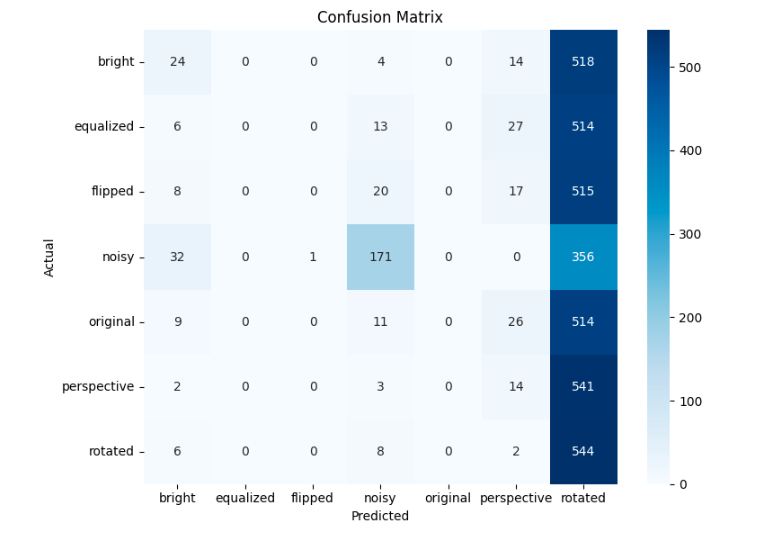

# DualFeatureNet-Combining-Traditional-and-Deep-Features

* Project overview
* Dataset details
* Preprocessing steps
* Hybrid model (CNN + ORB features)
* Training strategy
* Evaluation (accuracy, precision, recall, F1-score)
* How to run
* Results with visualization
* Folder structure


```markdown
## Image Classification using Hybrid Deep Learning (CNN + ORB)

This project combines Convolutional Neural Networks (CNN) with OpenCV ORB descriptors to improve image classification. The model uses both pixel-based features and handcrafted features to achieve better performance, especially on complex or distorted images.

---

##  Dataset

- Custom image dataset stored in:
```

/split\_dataset/
train/
val/
test/

````
- Each subfolder corresponds to a class name (e.g., `bright`, `dark`, etc.).

---

## Objective

> Build a hybrid classification model by combining:
> Features from a pretrained CNN (ResNet50)
> Keypoint-based ORB descriptors from OpenCV

---

## Preprocessing

1. Images resized to 224x224 and normalized
2. ORB (Oriented FAST and Rotated BRIEF) descriptors extracted using OpenCV
3. Flattened and padded to fixed-length vectors (512)
4. Labels encoded using `LabelEncoder`

---

## Model Architecture

- Image input: Pretrained `ResNet50` (frozen)
- ORB input: Dense layers with dropout
- Fusion: Concatenation of CNN + ORB features
- Final Output: Softmax for multi-class classification

```python
image_input = Input(shape=(224, 224, 3))
orb_input = Input(shape=(512,))
...
combined = Concatenate()([cnn_output, orb_output])
final_output = Dense(num_classes, activation='softmax')(combined)
````

---

## Training Strategy

* Optimizer: `Adam`
* Loss: `categorical_crossentropy`
* Epochs: `10`
* Early stopping and checkpoints enabled
* Saved model: `manual_batch_model.h5`

---

## Evaluation Metrics

Model evaluated on **test set** using:

| Metric    | Description                                       |
| --------- | ------------------------------------------------- |
| Accuracy  | Overall correctness                               |
| Precision | Correctness of predicted positives                |
| Recall    | Sensitivity (how well actual positives are found) |
| F1-Score  | Balance between precision and recall              |

---

## Visualizations

### Confusion Matrix

Displays the class-wise performance of the model.



### ROC Curve

Shows the trade-off between true positive and false positive rates for each class.


---

## How to Run

1. Clone the repo

2. Prepare your dataset in the format:

   ```
   /split_dataset/train/class_name/image.jpg
   /split_dataset/test/class_name/image.jpg
   ```

3. Run the training script:

   ```python
   model.fit([X_img, X_orb], y, epochs=10, ...)
   ```

4. Evaluate:

   ```python
   model.evaluate(...)
   ```

---

## 🙋‍♀️ Author

**Pavithra Arjunan**
Machine Learning | Python | Deep Learning
[LinkedIn](#) • [GitHub](#) • [Portfolio](#)

---

## 📝 License

This project is open-sourced for educational and research purposes.

```

